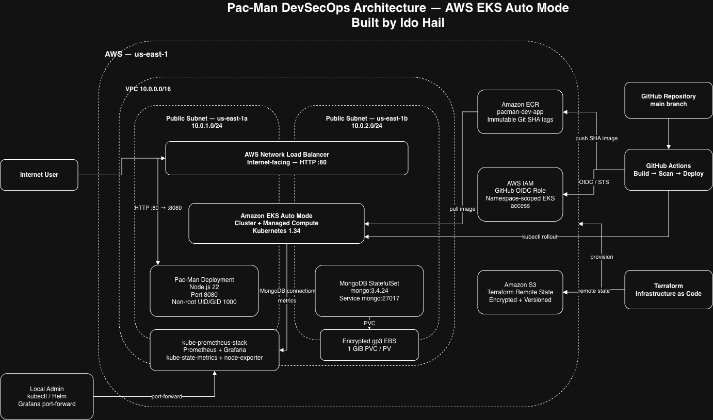

# Pac-Man on AWS EKS Auto Mode

DevSecOps final project that deploys a containerized Pac-Man application and MongoDB on **Amazon EKS Auto Mode**.

The application itself is based on the supplied Pac-Man project. This repository focuses on the DevSecOps layer: Infrastructure as Code, Kubernetes deployment, CI/CD, persistent storage, monitoring, security controls, automated launch and complete teardown.

## Architecture



Editable source: [`docs/architecture.drawio`](docs/architecture.drawio)

The environment runs in `us-east-1` and includes:

- Terraform-managed VPC with two public subnets across two Availability Zones
- Amazon EKS Auto Mode
- Amazon ECR with immutable Git-SHA image tags
- two-replica Pac-Man Deployment
- MongoDB StatefulSet with encrypted `gp3` EBS storage
- Kubernetes NetworkPolicy restricting MongoDB ingress to Pac-Man Pods
- internet-facing AWS Network Load Balancer configuration
- Prometheus and Grafana through `kube-prometheus-stack`
- GitHub Actions CI/CD authenticated to AWS with OIDC
- encrypted and versioned S3 Terraform remote state

Public subnets and no NAT Gateway are intentional lab trade-offs to keep the architecture simple and cost-conscious.

## Repository Structure

```text
.
├── .github/workflows/ci-cd.yml    # CI/CD pipeline
├── docs/                          # architecture diagram
├── k8s/                           # Kubernetes manifests
├── monitoring/                    # Prometheus/Grafana values
├── scripts/
│   ├── launch.py                  # preview and full deployment
│   └── terminate.py               # preview and full teardown
├── terraform/
│   ├── bootstrap/                 # S3 remote-state bootstrap
│   └── modules/                   # network, EKS, ECR and GitHub OIDC
├── Dockerfile
├── package.json
├── package-lock.json
└── README.md
```

Application source and static assets remain in `app.js`, `bin/`, `lib/`, `routes/`, `views/` and `public/`.

## Prerequisites

The project can be cloned and launched from a new machine without manually creating Terraform state or other AWS project resources first.

Required locally:

- Python 3
- AWS CLI v2
- Terraform
- Docker
- kubectl
- Helm
- Git

AWS CLI must already be authenticated to the project AWS account (`506456084249`) with permissions to create and remove the required resources.

Verify the active identity:

```bash
aws sts get-caller-identity
```

`launch.py` checks the AWS account before making changes and aborts if the active account is not the expected project account.

Application dependencies do not require a separate host-side `npm install`: the Docker build installs the locked production dependencies with `npm ci --omit=dev`.

## Run the Project

Clone the repository and enter it:

```bash
git clone https://github.com/ido-hail/pacman-project.git
cd pacman-project
```

### 1. Preview

```bash
python3 scripts/launch.py
```

Preview mode performs the safety and Terraform checks without creating the EKS runtime.

On a fresh environment, the script automatically creates the encrypted, versioned S3 Terraform state bucket if it does not already exist. No manual backend bootstrap is required.

### 2. Create the environment

```bash
python3 scripts/launch.py --apply
```

The script asks for confirmation before creating billable AWS resources.

For non-interactive execution:

```bash
python3 scripts/launch.py --apply --yes
```

The deployment flow is:

```text
preflight checks
      ↓
S3 state bootstrap
      ↓
Terraform apply
      ↓
EKS Auto Mode + ECR
      ↓
Docker build + non-root verification + immutable image push
      ↓
MongoDB StatefulSet + persistent EBS
      ↓
Pac-Man Deployment
      ↓
internal HTTP and MongoDB validation
      ↓
NLB provisioning attempt
      ↓
Prometheus + Grafana
      ↓
final runtime summary
```

The launcher builds the application for `linux/amd64`, pushes an immutable `bootstrap-<git-sha>` image to ECR and renders the Kubernetes Deployment with that exact image.

## Kubernetes Runtime

Pac-Man runs with:

- 2 replicas
- Node.js 22
- non-root UID/GID `1000`
- CPU and memory requests/limits
- readiness and liveness probes
- `RollingUpdate` with `maxUnavailable: 0`
- privilege escalation disabled and Linux capabilities dropped

MongoDB runs as `mongo:3.4.24` with:

- one StatefulSet replica
- Service `mongo:27017`
- non-root UID/GID `999`
- encrypted `1Gi` `gp3` PVC/PV
- EKS Auto Mode EBS CSI provisioning
- NetworkPolicy allowing TCP `27017` only from Pods labeled `app: pacman`

## CI/CD

Workflow: `.github/workflows/ci-cd.yml`

Pull requests to `main` run validation without deploying. A push to `main` runs validation and, while the EKS runtime exists, deploys the new image.

Pipeline:

```text
Terraform fmt / validate
        +
npm ci → npm audit → Docker build → non-root check → Trivy gate
        ↓
AWS OIDC authentication
        ↓
immutable Git-SHA image push to ECR
        ↓
Kubernetes manifest apply
        ↓
MongoDB and Pac-Man rollout verification
```

The CI/CD path uses GitHub OIDC instead of long-lived AWS access keys. Its Kubernetes access is limited to the `pacman` namespace.

The blocking Trivy gate fails on fixable `HIGH` or `CRITICAL` image vulnerabilities.

## Security Controls

Implemented controls include:

- GitHub OIDC for AWS authentication
- repository/branch-scoped OIDC trust
- namespace-scoped EKS access for CI/CD
- immutable ECR image tags
- digest-pinned Node base image
- non-root Pac-Man and MongoDB containers
- disabled privilege escalation and dropped Linux capabilities
- Kubernetes NetworkPolicy for MongoDB
- encrypted EBS persistent storage
- CPU and memory limits
- Trivy image scanning
- npm dependency audit
- GitHub Actions pinned to commit SHAs
- Terraform formatting and validation in CI

The supplied application contains legacy components, so `npm audit` is informational while the final container image is protected by the blocking Trivy gate.

## Monitoring

Monitoring uses `kube-prometheus-stack 87.21.0` with Prometheus, Grafana, kube-state-metrics and node-exporter.

Monitoring is internal only; no public Grafana LoadBalancer or Ingress is created.

Access Grafana while the environment is running:

```bash
kubectl port-forward -n monitoring svc/pacman-monitoring-grafana 3000:80
```

Open `http://localhost:3000` and use username `admin`.

Retrieve the generated password:

```bash
kubectl get secret pacman-monitoring-grafana \
  -n monitoring \
  -o jsonpath='{.data.admin-password}' \
  | base64 --decode; echo
```

## Network Load Balancer Note

The Pac-Man Service is configured for an internet-facing EKS Auto Mode NLB using IP targets.

During project validation, the AWS account returned the account-level error:

```text
OperationNotPermitted: This AWS account currently does not support creating load balancers.
```

The Kubernetes and EKS Auto Mode NLB configuration is present, but AWS currently blocks the `CreateLoadBalancer` API for this account. `launch.py` detects this specific condition and reports:

```text
Public NLB: BLOCKED_BY_AWS
```

The rest of the environment continues through validation and monitoring. Pac-Man can still be reached for local validation with:

```bash
kubectl port-forward -n pacman deployment/pacman 8000:8080
```

Then open `http://localhost:8000`.

## Remove the Project

### 1. Preview teardown

```bash
python3 scripts/terminate.py
```

This shows the Terraform destroy preview and current project inventory without deleting resources.

### 2. Destroy everything

```bash
python3 scripts/terminate.py --destroy
```

For non-interactive execution:

```bash
python3 scripts/terminate.py --destroy --yes
```

The teardown removes Kubernetes workloads and monitoring first, destroys the Terraform-managed AWS infrastructure, waits for EKS Auto Mode compute/storage cleanup, verifies that no active project runtime resources remain, then deletes **all versions of the Terraform state and the S3 state bucket itself**.

Final verification checks for zero remaining:

```text
EKS clusters
active Auto Mode EC2 instances
EBS volumes
Load Balancers
Target Groups
project VPCs
Terraform runtime resources
```

The final project teardown was validated successfully, including deletion of the remote-state S3 bucket.

## Validation Summary

The completed project was runtime-tested for:

- Terraform create/destroy
- EKS Auto Mode deployment
- Docker/ECR immutable image workflow
- Pac-Man to MongoDB connectivity
- internal HTTP `200`
- persistent EBS storage and MongoDB Pod recreation
- MongoDB non-root execution
- NetworkPolicy enforcement
- GitHub Actions OIDC CI/CD and automatic deployment
- Terraform CI validation
- blocking Trivy gate with zero fixable `HIGH`/`CRITICAL` findings
- Prometheus/Grafana monitoring
- complete teardown with no active project resources remaining

The only unresolved runtime item is the external AWS account restriction on load balancer creation described above.
